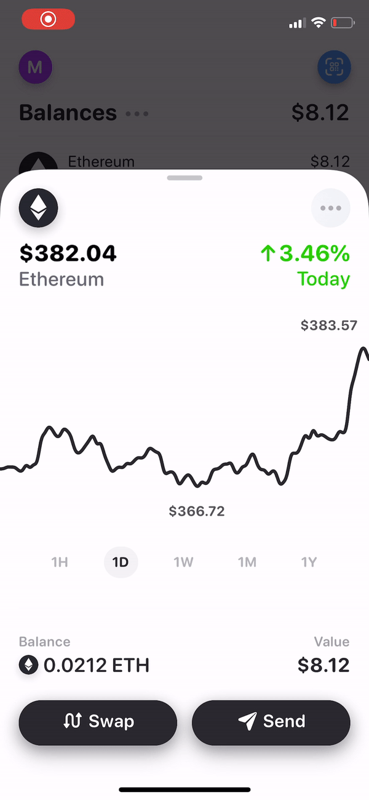
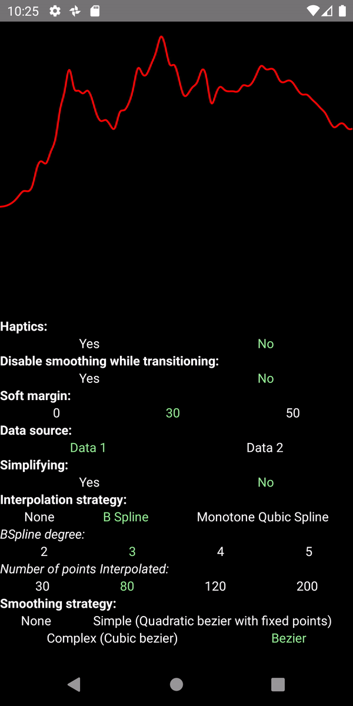
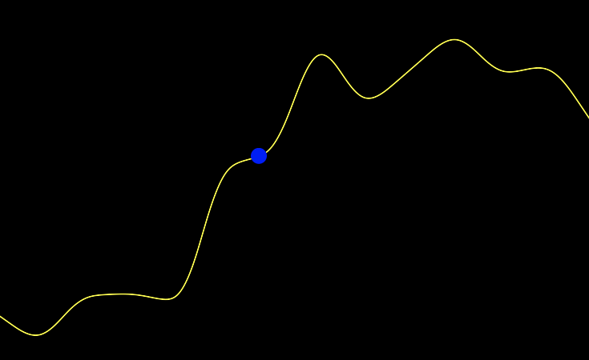

<p align="center">
  <h1 align="center">React Native Animated Charts</h1>
  <h3 align="center">Set of components and helpers for building complex and beautifully animated charts.</h3>
</p>

|  |  |
| :---------------: | :-------------------: |

The library was designed to create aesthetic, animated (so far only linear) charts based on a given input.
The main assumptions of the library were to create smooth transitions between subsequent data sets. For this reason,
we have discovered a shortage of existing libraries related to the charts.
The current package was created as part of the [Rainbow.me project](https://rainbow.me/) and for this reason it was not designed as a complete and comprehensive solution for displaying various types of charts. However, we will be now using more charts in the whole application, so we believe that the number of functionalities in the application will gradually grow.

Additionally, we are open to new Pull Requests. We want this library to become popular and complete thanks to community activity.

It's a part of the [Rainbow.me project](https://rainbow.me/).

## Installation

1. Install [react-native-reanimated](https://docs.swmansion.com/react-native-reanimated/docs/next/installation) in the newest version.
2.

```bash
yarn add react-native-animated-charts
```

The library has been verified with `2.0.0-alpha.6` version of reanimated.

### Reanimated

Using TurboModules might have an impact on your current development flow and most likely
you don't want to decrease your DX. Since we're not using reanimated in other places in the app, we
made some tweaks to disable charts in development mode with compilation macros on iOS.
You can find it [here](https://github.com/rainbow-me/rainbow/blob/develop/ios/Rainbow/AppDelegate.mm)

Also, because we're using libraries which currently do not support reanimated 2,
we [patched exports in reanimated](https://github.com/rainbow-me/rainbow/tree/develop/patches)

Furthermore, we found few differences in how the `Animated` module works with and without TurboModules support, so
we [made a trick](https://github.com/rainbow-me/rainbow/tree/develop/patches) to fallback to the not-TM version of Animated.

Most likely, you don't need any of those patches.

## Example app

We made a generic example to show briefly what's possible to achieve with this library.
A Real-life example is available inside [Rainbow](https://github.com/rainbow-me)!

In order to run an example clone this repo and navigate to `Example` then:

```
yarn && cd ios && pod install && cd ..
react-native run-android
react-native run-ios
```

## API

The library has been designed to provide as much flexibility as possible with the component-based API for easy integration with existing applications.

### Basic API Example

```jsx
import React from 'react';
import { Dimensions, View } from 'react-native';
import { ChartDot, ChartPath, ChartPathProvider, monotoneCubicInterpolation } from 'react-native-animated-charts';

export const { width: SIZE } = Dimensions.get('window');

export const data = [
  { x: 1453075200, y: 1.47 },
  { x: 1453161600, y: 1.37 },
  { x: 1453248000, y: 1.53 },
  { x: 1453334400, y: 1.54 },
  { x: 1453420800, y: 1.52 },
  { x: 1453507200, y: 2.03 },
  { x: 1453593600, y: 2.1 },
  { x: 1453680000, y: 2.5 },
  { x: 1453766400, y: 2.3 },
  { x: 1453852800, y: 2.42 },
  { x: 1453939200, y: 2.55 },
  { x: 1454025600, y: 2.41 },
  { x: 1454112000, y: 2.43 },
  { x: 1454198400, y: 2.2 },
];

const points = monotoneCubicInterpolation(data)(40);

const BasicExample = () => (
  <View style={{ backgroundColor: 'black' }}>
    <ChartPathProvider data={{ points, smoothingStrategy: 'bezier' }}>
      <ChartPath height={SIZE / 2} stroke="yellow" width={SIZE} />
      <ChartDot style={{ backgroundColor: 'blue' }} />
    </ChartPathProvider>
  </View>
);
```

The code above generates the chart below:



### Linear charts

### `ChartPathProvider`

The whole chart's structure has to be wrapped with `ChartProvider`. It's responsible for data managing and itself does not have a visual impact on the layout. Under the hood, it uses context API to simplify manipulation with other components. The rule is to use one data series for each wrapper.
It's important to have it as a separated component because under this component it's possible `useChartData` hook and put `ChartDot` component. However, if you don't need those features, you can pass `data` directly to `ChartPath` and drop this wrapper.

| Prop name | type                                                                                                                                | default / obligatory | description                                                                                          |
| --------- | ----------------------------------------------------------------------------------------------------------------------------------- | -------------------- | ---------------------------------------------------------------------------------------------------- |
| `data`    | <code>{ points: [Point], nativePoints: [Point], smoothingStrategy?: 'bezier'&#124;'simple'&#124;'complex', smoothingFactor }<code/> | obligatory           | Object containing data structure and way to display them. Each of the properties is explained below. |

- `points` is an array containing `Point`s to be displayed. A `Point` is an object containing `x` and `y` as a number.
- `originalData` is an array of points that will not be drawn. However, if you used some strategy of interpolating data or simplifying you might want to present data slightly different from the real one. Then if you'd like labels to be fully correct you may want to provide real data before adjusting them.
- `smoothingStrategy`. While presenting points path can be drawn with different approaches.
  - If `smoothingStrategy` is not provided (or set to any other value but for listed here), connects points using linear interpolation.
  - The `bezier` strategy connects points with a bezier path inspired by [d3 shape](https://github.com/d3/d3-shape/blob/master/src/curve/basis.js). It's not parametrized by `smoothingFactor`.
  - The `complex` strategy uses approach explained [here](https://medium.com/@francoisromain/smooth-a-svg-path-with-cubic-bezier-curves-e37b49d46c74) using cubic splines. It's parametrized by `smoothingFactor`.
  - The `simple` strategy is a bit simplified `complex` strategy using quadratic splines. It's parametrized by `smoothingFactor`.
- `smoothingFactor`. Is a value from `0` to `1` defining how smooth a presentation should be. `0` means no smoothing, and it's the default. `smoothingFactor` has an impact if `smoothingStrategy` is `simple` or `complex`.

### `ChartPath`

This component is used for showing the path itself.

| Prop name                            | type      | default / obligatory                                                  | description                                                                                                                                                                                                              |
| ------------------------------------ | --------- | --------------------------------------------------------------------- | ------------------------------------------------------------------------------------------------------------------------------------------------------------------------------------------------------------------------ |
| `smoothingWhileTransitioningEnabled` | `number`  | `false`                                                               | Although smoothing is not complex computing, it might impact performance in some low-end devices so while having a big set of data it might be worth disable smoothing while transitioning.                              |
| `height`                             | `number`  | obligatory                                                            | Height od the SVG canvas                                                                                                                                                                                                 |
| `width`                              | `number`  | obligatory                                                            | Width od the SVG canvas                                                                                                                                                                                                  |
| `strokeWidth`                        | `number`  | `1`                                                                   | Width of the path.                                                                                                                                                                                                       |
| `selectedStrokeWidth`                | `number`  | `1`                                                                   | Width of the path selected.                                                                                                                                                                                              |
| `gestureEnabled`                     | `boolean` | `true`                                                                | Defines if interaction with the chart should be allowed or not                                                                                                                                                           |
| `longPressGestureHandlerProps`       | `object`  | `{maxDist: 100000, minDurationMs: 0, shouldCancelWhenOutside: false}` | Under the hood we're using `LongPressGestureHandler` for handling interactions. It's recommended to not override its props. However, it might be useful while interacting with another GH.                               |
| `selectedOpacity`                    | `number`  | `0.7`                                                                 | Target opacity of the path while touching the chart.                                                                                                                                                                     |
| `hitSlop`                            | `number`  | `0`                                                                   | While scrubbing the chart touching edges of the screen you may want make points on the edges more accessible. With `hitSlop` it's possible to access points on edges doubling the speed of scrubbing beyond this margin. |
| `hapticsEnabled`                     | `boolean` | `false`                                                               | On pressing in/out on the chart it might be expected to make haptic feedback. It will happen with `hapticsEnabled` set to `true`.                                                                                        |
| `springConfig`                       | object    | `{damping: 15, mass: 1, stiffness: 600}`                              | Object [defining the spring animation](https://docs.swmansion.com/react-native-reanimated/docs/next/animations). This spring is used for a dot's scale.                                                                  |
| `timingFeedbackConfig`               | object    | `{duration: 80}`                                                      | Object [defining the timing animation](https://docs.swmansion.com/react-native-reanimated/docs/next/animations). `timingFeedbackConfig` is used for a path's opacity and width.                                          |
| `timingAnimationConfig`              | object    | `{duration: 300}`                                                     | Object [defining the timing animation](https://docs.swmansion.com/react-native-reanimated/docs/next/animations). `timingAnimationConfig` is used for the transition between chart's data.                                |
| ...rest                              | `object`  | `{}`                                                                  | Props applied to SVG [Path](https://github.com/react-native-community/react-native-svg#path).                                                                                                                            |

### `ChartDot`

Component for displaying the dot for scrubbing on the chart.

| Prop name | type     | default | description                                                      |
| --------- | -------- | ------- | ---------------------------------------------------------------- |
| `size`    | `number` | `10`    | Size of the dot.                                                 |
| ...props  | `object` | `{}`    | Rest of the props applied to `Reanimated.View` including `style` |

### `ChartYLabel` & `ChartXLabel`

Labels are useful while moving finger through the chart to show the exact value in given point.

| Prop name | type               | default  | description                                                                                             |
| --------- | ------------------ | -------- | ------------------------------------------------------------------------------------------------------- |
| `format`  | reanimated worklet | `a => a` | Worklet for formatting data from the chart. It can be useful when your data is a timestamp or currency. |
| ...props  | `object`           | `{}`     | Rest of the props applied to `TextInput` including `style`                                              |

### Candle Charts

TODO

### Pie charts

TODO

## Helpers

It's not essential in the library, but we have decided to include a lot of helpers we are (or we were) using for displaying charts.

## Interpolations

We have two interpolators which share the most of the API: `bSplineInterpolation` and `monotoneCubicInterpolation`.

```js
import { bSplineInterpolation as interpolator } from 'react-native-animated-charts';
// import { monotoneCubicInterpolation as interpolator } from 'react-native-animated-charts';

const interpolatedData = interpolator({ data, range: 80 });
```

Code above generates 80 equidistant points from given dataset.
Generator accepts object of parameters as an argument:

- `data` - input of points.
- `range` is the number of points of the output.
- `includeExtremes`. If it's vital to include extremes in the output, set to true. However, the data might not be fully equidistant.
- `removePointsSurroundingExtremes`. Makes sense only if `includeExtremes` set to `true`. When disabled, it might be possible that extremes look very "pointy". To get rid of this, you can remove points surrounding extremes.
  E.g.

  - `removePointsSurroundingExtremes = false`

    `o---------o----Min--o---------o---------o---------o---------o`

  - `removePointsSurroundingExtremes = true`

    `o--------------Min------------o---------o---------o---------o`

### `bSplineInterpolation({ degree = 3, ...params })`

`bSplineInterpolation` is inspired by [victorian lib](https://github.com/networkcube/vistorian/blob/17e2be9b51267509ea67b5984421d8c03558d928/core/lib/BSpline.js)
and uses [B-spline](https://en.wikipedia.org/wiki/B-spline) interpolation of a given `degree`.

### `monotoneCubicInterpolation({ ...params })`

This curve is inspired by [d3 shape](https://github.com/d3/d3-shape/blob/master/src/curve/monotone.js).
"Produces a cubic spline that preserves monotonicity in y, assuming monotonicity in x, as proposed by Steffen in A simple method for monotonic interpolation in one dimension: “a smooth curve with continuous first-order derivatives that passes through any given set of data points without spurious oscillations. Local extrema can occur only at grid points where they are given by the data, but not in between two adjacent grid points.”

## `simplifyData(data, pickRange = 10, includeExtremes = true)`

This helper takes only one point per `pickRange`. Might be useful for very dense data. If it's important, it's possible to include extremes with the `includeExtremes` flag.
E.g.

`pickRange = 3, includeExtremes = true`

```
X are equidistant in this case

Y:0          1          7          2         -3          0          1          2
  S----------o----------E----------X----------E----------o----------X----------o----------S
```

`X` - points picked because `index%3=0`

`S` – the first and the last points are always included.

`E` – extremes.

## `useChartData`

It's a bit advanced hook and contains information about current position of dot and corresponding values. Content of the result is changing often, so it's not worth deep documentation now.

## TODO

The library has been released in a production-ready version.
We use it inside the [Rainbow.me project](https://rainbow.me/) so it's verified for use in production.
However, it relies on [React Native Reanimated 2.0](https://docs.swmansion.com/react-native-reanimated/) in the alpha version thus it might not work perfectly.
Test it deeply before using it. Until the stable release of Reanimated 2, I think it's worth not marking this library as stable.
Although the library works with Reanimated without any changes, we faced a few issues related to our (quite advanced) usage of the library.
Thus we made some hacks we're not very proud of and it's for 99% something you should not do. However, if you see some crashes, you may try one of our hacks.

There're a few things left to make it polished regarding linear charts:

- [ ] Support for gestures - pinching, swiping, etc.
- [ ] more parameters regarding interpolation, smoothing, and animations (i.e. allow to override `springConfig` and `timingConfig`)
